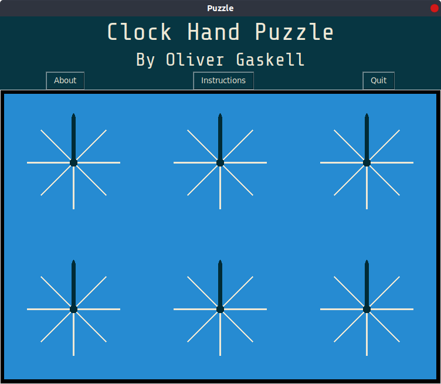

# Clock Hand Puzzle

A puzzle game made with Python3 + Tkinterm based around the idea of rotating "clock" hands.

Your task is to rotate the clock hands to make them all point upwards. However, turning one may affect another. You need to work out what affects what, and use this to solve the puzzle.

To rotate a hand, click on the left or right of that hand to rotate it anti-clockwise or clockwise respectively.
